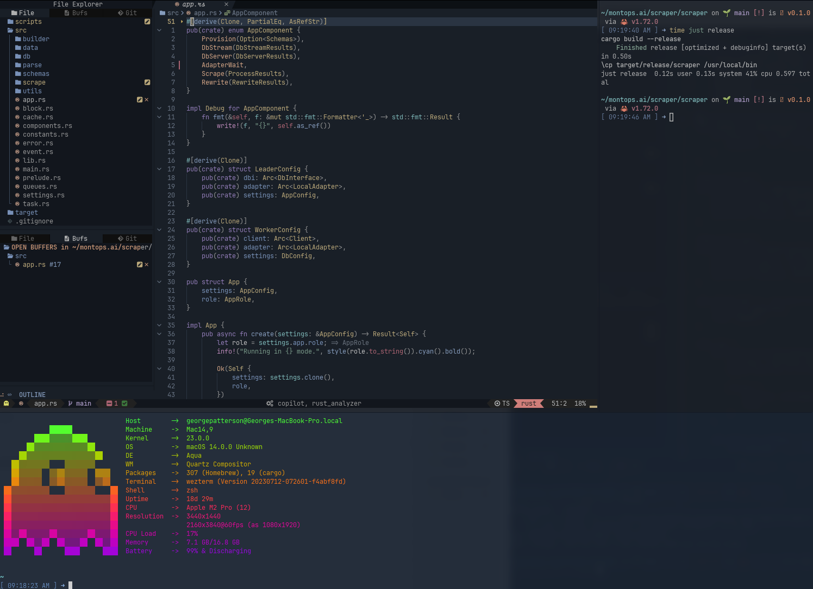

# Neovim Custom Configuration (over AstroNvim)

My user configuration overrides for [AstroNvim](https://github.com/AstroNvim/AstroNvim)

## 📸 Screenshots

#### Dashboard


#### Editor


#### Themes


#### Wezterm integration



## 🛠️ Installation

#### Make a backup of your current nvim and shared folder

```shell
mv ~/.config/nvim ~/.config/nvim.bak
mv ~/.local/share/nvim ~/.local/share/nvim.bak
```

#### Clone AstroNvim

```shell
git clone https://github.com/AstroNvim/AstroNvim ~/.config/nvim
```

#### Create a new user repository from this template

Press the "Use this template" button above to create a new repository to store your user configuration.

You can also just clone this repository directly if you do not want to track your user configuration in GitHub.

#### Clone the repository

```shell
git clone https://github.com/<your_user>/<your_repository> ~/.config/nvim/lua/user
```

#### Start Neovim

```shell
$ nvim
```

## Plugins

- [cmp-buffer](https://github.com/hrsh7th/cmp-buffer)
- [cmp-emoji](https://github.com/hrsh7th/cmp-emoji)
- [cmp-nvim-lsp](https://github.com/hrsh7th/cmp-nvim-lsp)
- [cmp-path](https://github.com/hrsh7th/cmp-path)
- [cmp_luasnip](https://github.com/saadparwaiz1/cmp_luasnip)
- [diffview.nvim](https://github.com/sindrets/diffview.nvim)
- [dressing.nvim](https://github.com/stevearc/dressing.nvim)
- [friendly-snippets](https://github.com/rafamadriz/friendly-snippets)
- [gitsigns.nvim](https://github.com/lewis6991/gitsigns.nvim)
- [gruvbox.nvim](https://github.com/ellisonleao/gruvbox.nvim)
- [indent-blankline.nvim](https://github.com/lukas-reineke/indent-blankline.nvim)
- [lazy.nvim](https://github.com/folke/lazy.nvim)
- [lualine.nvim](https://github.com/nvim-lualine/lualine.nvim)
- [LuaSnip](https://github.com/L3MON4D3/LuaSnip)
- [mason-lspconfig.nvim](https://github.com/williamboman/mason-lspconfig.nvim)
- [mason.nvim](https://github.com/williamboman/mason.nvim)
- [neo-tree.nvim](https://github.com/nvim-neo-tree/neo-tree.nvim)
- [neoconf.nvim](https://github.com/folke/neoconf.nvim)
- [neodev.nvim](https://github.com/folke/neodev.nvim)
- [neogit](https://github.com/TimUntersberger/neogit)
- [noice.nvim](https://github.com/folke/noice.nvim)
- [nui.nvim](https://github.com/MunifTanjim/nui.nvim)
- [none-ls.nvim](https://github.com/nvimtools/none-ls.nvim)
- [nvim-cmp](https://github.com/hrsh7th/nvim-cmp)
- [nvim-colorizer.lua](https://github.com/NvChad/nvim-colorizer.lua)
- [nvim-dap](https://github.com/mfussenegger/nvim-dap)
- [nvim-dap-ui](https://github.com/rcarriga/nvim-dap-ui)
- [nvim-lspconfig](https://github.com/neovim/nvim-lspconfig)
- [nvim-notify](https://github.com/rcarriga/nvim-notify)
- [nvim-spectre](https://github.com/windwp/nvim-spectre)
- [nvim-treesitter](https://github.com/nvim-treesitter/nvim-treesitter)
- [nvim-treesitter-textobjects](https://github.com/nvim-treesitter/nvim-treesitter-textobjects)
- [nvim-ts-context-commentstring](https://github.com/JoosepAlviste/nvim-ts-context-commentstring)
- [nvim-web-devicons](https://github.com/nvim-tree/nvim-web-devicons)
- [oxocarbon.nvim](https://github.com/shaunsingh/oxocarbon.nvim)
- [peek.nvim](https://github.com/toppair/peek.nvim)
- [plenary.nvim](https://github.com/nvim-lua/plenary.nvim)
- [rust-tools.nvim](https://github.com/simrat39/rust-tools.nvim)
- [SchemaStore.nvim](https://github.com/b0o/SchemaStore.nvim)
- [sqlite.lua](https://github.com/kkharji/sqlite.lua)
- [symbols-outline.nvim](https://github.com/simrat39/symbols-outline.nvim)
- [telescope-fzf-native.nvim](https://github.com/nvim-telescope/telescope-fzf-native.nvim)
- [telescope.nvim](https://github.com/nvim-telescope/telescope.nvim)
- [tokyonight.nvim](https://github.com/folke/tokyonight.nvim)
- [treesj](https://github.com/Wansmer/treesj)
- [trouble.nvim](https://github.com/folke/trouble.nvim)
- [twilight.nvim](https://github.com/folke/twilight.nvim)
- [typescript-tools.nvim](https://github.com/pmizio/typescript-tools.nvim)
- [vim-illuminate](https://github.com/RRethy/vim-illuminate)
- [which-key.nvim](https://github.com/folke/which-key.nvim)
- [yanky.nvim](https://github.com/gbprod/yanky.nvim)
- [zen-mode.nvim](https://github.com/folke/zen-mode.nvim)
